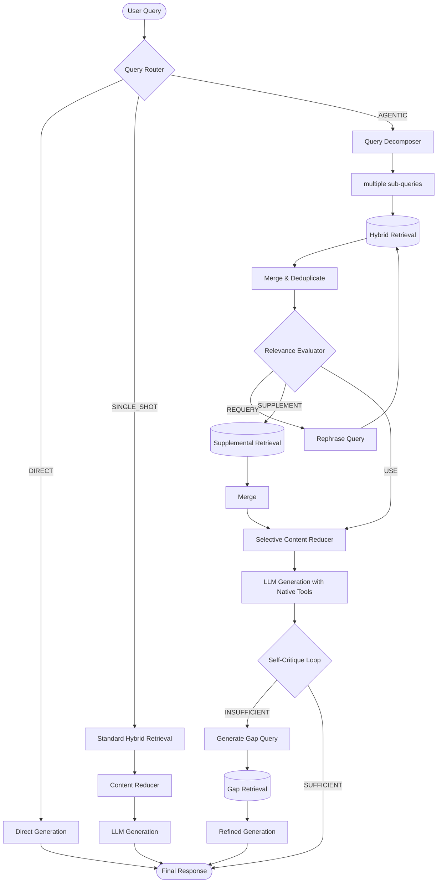

# Agentic System Architecture

Sage represents a paradigm shift from traditional "dumb" RAG (Retrieval-Augmented Generation) to an **Agentic RAG** system that actively reasons about user queries, evaluates its own retrieved context, and refines its answers iteratively—all completely on-device.

## Agentic RAG Pipeline Visualization

The following diagram illustrates the lifecycle of a query as it traverses Sage's agentic orchestrator.

## Core Agentic Components

All components are located within the `app/src/main/java/com/sage/localai/agentic/` package.

### 1. Query Router (`QueryRouter.kt`)
The router acts as the front door, determining the computational path needed for a given user prompt. 
- **DIRECT**: Simple conversational inputs ("hello", "thanks") bypass retrieval entirely to save API/compute overhead and battery.
- **SINGLE_SHOT**: Fact-finding questions with clear keywords where simple hybrid retrieval is sufficient.
- **AGENTIC**: Complex, multi-part, or comparative queries that require the full pipeline.

### 2. Query Decomposer (`QueryDecomposer.kt`)
Complex questions typically dilute dense vector retrievals. The Decomposer asks the LLM to break a complex prompt (e.g., "Compare the safety findings in doc A and doc B") into discrete sub-queries (e.g., "What are safety findings in doc A?", "What are safety findings in doc B?").

### 3. Relevance Evaluator (CRAG) (`RelevanceEvaluator.kt`)
Implements Corrective RAG (CRAG). Before feeding retrieved chunks to the generation LLM, a lightweight evaluator checks the semantic relevance of the retrieved context against the user query.
- **USE**: The context is highly relevant. Proceed to generation.
- **SUPPLEMENT**: The context is okay but might be missing broader details. Triggers an additional broad retrieval.
- **REQUERY**: The context is irrelevant. Triggers a LLM rephrasing of the search query and a retry (up to 2 times).

### 4. Selective Content Reducer (`SelectiveContentReducer.kt`)
Raw context chunks often contain noise. This heuristic layer trims trailing sections, removes redundancy, and ensures that the final structured context strings are as token-efficient as possible before context injection (~30% reduction in tokens without losing facts).

### 5. Native Tool Calling (`RagAgentTools.kt`)
Rather than relying purely on pre-retrieved context, the pipeline exposes native Android tools to the local Gemma 4 model (like `search_documents`, `get_document_section`). The model can autonomously choose to suspend generation, invoke a tool, and resume with newly fetched data.

### 6. Self-Critique Loop (`SelfCritiqueLoop.kt`)
After the first response is generated, an independent critique LLM pass evaluates the generated response against the original question and the retrieved context. If it detects that the answer is lacking specifics or hallucinated (e.g., "The document doesn't say..."), it produces a gap query. This gap query kicks off a targeted retrieval and an addendum answer generation stringing the correct final facts.
