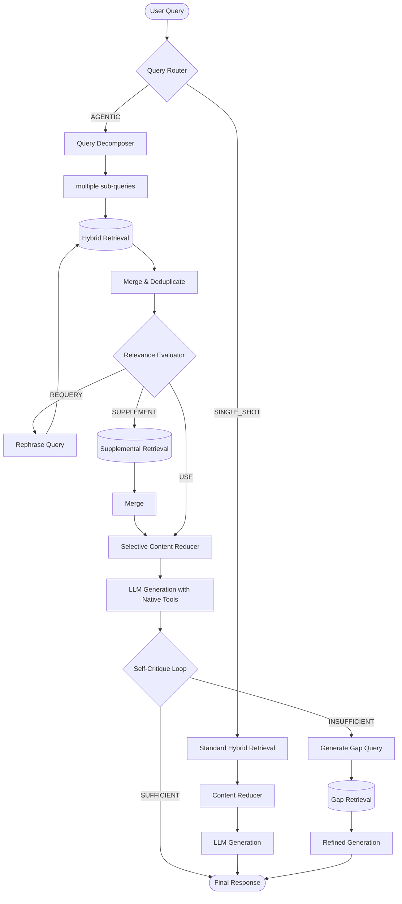

# Agentic System Architecture

Anvit represents a paradigm shift from traditional "dumb" RAG (Retrieval-Augmented Generation) to an **Agentic RAG** system that actively reasons about user queries, evaluates its own retrieved context, and refines its answers iteratively—all completely on-device.

## App Theme Colors

Material3 `primary` maps to the Anvit `accent` token, and Material3 `secondary` maps to the Anvit `txt1` token.

- Dark / Midnight theme: primary `#00C8E8`, secondary `#8BAFC8`
- Light / Dawn theme: primary `#0099BA`, secondary `#2A5068`

## Agentic RAG Pipeline Visualization

The following diagram illustrates the lifecycle of a query as it traverses Sage's agentic orchestrator.

## Core Agentic Components

All components are located within the `app/src/main/java/com/anvit/localai/agentic/` package.

### 1. Query Router (`QueryRouter.kt`)
The router acts as the front door, determining the computational path needed for a given user prompt.
- **SINGLE_SHOT**: Fact-finding questions with clear keywords where simple hybrid retrieval is sufficient.
- **AGENTIC**: Complex, multi-part, or comparative queries that require the full pipeline.

### 2. Query Decomposer (`QueryDecomposer.kt`)
Complex questions typically dilute dense vector retrievals. The Decomposer asks the LLM to break a complex prompt (e.g., "Compare the safety findings in doc A and doc B") into discrete sub-queries (e.g., "What are safety findings in doc A?", "What are safety findings in doc B?").

### 3. Relevance Evaluator (CRAG) (`RelevanceEvaluator.kt`)
Implements Corrective RAG (CRAG). Before feeding retrieved chunks to the generation LLM, a lightweight evaluator checks the semantic relevance of the retrieved context against the user query.
- **USE**: The context is highly relevant. Proceed to generation.
- **SUPPLEMENT**: The context is okay but might be missing broader details. Triggers an additional broad retrieval.
- **REQUERY**: The context is irrelevant. Triggers a LLM rephrasing of the search query and a retry (up to 2 times).

### 4. Selective Content Reducer (`SelectiveContentReducer.kt`)
Raw context chunks often contain noise. This heuristic layer trims trailing sections, removes redundancy, and ensures that the final structured context strings are as token-efficient as possible before context injection (~30% reduction in tokens without losing facts).

### 5. Native Tool Calling (`RagAgentTools.kt`)
Rather than relying purely on pre-retrieved context, the pipeline exposes native Android tools to the local Gemma 4 model (like `search_documents`, `get_document_section`). The model can autonomously choose to suspend generation, invoke a tool, and resume with newly fetched data.

### 6. Self-Critique Loop (`SelfCritiqueLoop.kt`)
After the first response is generated, an independent critique LLM pass evaluates the generated response against the original question and the retrieved context. If it detects that the answer is lacking specifics or hallucinated (e.g., "The document doesn't say..."), it produces a gap query. This gap query kicks off a targeted retrieval and an addendum answer generation stringing the correct final facts.

<claude-mem-context>
# Memory Context

# [AgenticRAG] recent context, 2026-05-13 8:04pm GMT+5:30

Legend: 🎯session 🔴bugfix 🟣feature 🔄refactor ✅change 🔵discovery ⚖️decision 🚨security_alert 🔐security_note
Format: ID TIME TYPE TITLE
Fetch details: get_observations([IDs]) | Search: mem-search skill

Stats: 50 obs (17,192t read) | 247,871t work | 93% savings

### May 6, 2026
S46 Fix device evaluation test failing with missing Gemma model files on Android device (May 6 at 9:32 AM)
S47 User asked whether to use USB debugging instead of wireless debugging for their phone development setup (May 6 at 9:42 AM)
S48 Fixed deprecated Project.android accessor in device eval model backup/restore gradle tasks (May 6 at 9:46 AM)
S49 Configure project :app to resolve build failure with missing connectedDebugAndroidTest task (May 6 at 9:48 AM)
S50 Increment version for new release of AgenticRAG Android app (May 6 at 10:42 AM)
S51 Determine correct Android foreground service permissions for on-device LLM app using FOREGROUND_SERVICE_DATA_SYNC and FOREGROUND_SERVICE_SPECIAL_USE (May 6 at 2:02 PM)
S52 Diagnose Gemma 4 model loading failure after recent app changes (May 6 at 2:11 PM)
S53 Fix inability to load Gemma 4 model after recent code changes in AgenticRAG Android app (May 6 at 4:11 PM)
S54 Update request received - status checkpoint (May 6 at 4:19 PM)
### May 13, 2026
316 12:53a 🔵 Kotlin compatibility fix verified - all removeFirst/removeLast replaced
317 " 🟣 Table answer engine integrated into agentic RAG orchestrator
318 " ✅ Enhanced system prompt grounding rules for document-based QA
319 12:54a 🔵 Kotlin compilation succeeded without removeFirst/removeLast errors
S55 Validate evaluation metrics after judge output fix by comparing runs 20260512-102523 and 20260512-135717 (May 13 at 12:54 AM)
320 " 🔵 Kotlin compatibility fix verified and compiled successfully
321 " 🔵 Fix completion verified - all removeFirst/removeLast replaced and no regressions found
322 12:55a 🔵 Run 20260512-135717 has complete evaluation data with zero empty rationale fields
323 " 🔵 Judge output fix caused model performance regression across all sample types
324 12:56a 🔵 Judge fix reveals retrieval failure as root cause, not model hallucination
325 " 🔵 Judge fix caused 10-12x latency explosion with no correctness improvement across sample types
326 12:57a 🔵 Judge fix is a critical regression: +122s latency, -7.45% correctness, only 7 of 53 samples improved
327 " 🔵 Judge fix breaks high-confidence adversarial and single-hop queries while marginally improving multi-hop
328 1:11a 🔵 Embedding model architecture supports both EmbeddingGemma and Gecko with EmbeddingGemma as default
329 " 🔵 Model storage and presence detection uses filesDir/models directory with isModelPresent checking
330 " 🔵 Complete embedding model initialization pipeline supports both models with status tracking and accelerator switching
331 1:12a 🔵 Embedding initialization happens at document ingestion start; getModelName() drives vector threshold selection
332 " 🔴 GeckoEmbeddingService now detects and auto-switches to newly downloaded embedding models without restart
333 1:13a 🟣 Added test verifying EmbeddingGemma is preferred when both embedding models are downloaded
334 " 🔵 GeckoEmbeddingServiceTest unit test passes - confirms EmbeddingGemma prioritization when both models present
335 1:15a ✅ GeckoEmbeddingServiceTest updated to use non-deprecated kotlin.io.path APIs
336 " 🔵 GeckoEmbeddingServiceTest compilation fails - kotlin.io.path.deleteRecursively() is experimental API
337 1:16a ✅ GeckoEmbeddingServiceTest fixed to use stable java.nio.file.Files API instead of experimental kotlin.io.path
338 " 🔵 GeckoEmbeddingServiceTest unit test passes after using stable java.nio.file.Files API
339 " 🟣 Document Ingestion Cancellation with Safe Cleanup
340 " 🔵 Gradle Build Compilation Success with Cancellation Implementation
341 1:25a 🔵 Document Ingestion Cancellation Implementation Verified and Compiled
342 1:31a 🔵 Document cancellation is asynchronous with potential hang points
343 " 🔵 Embedding service calls may block without cancellation awareness
344 " 🔵 Ingestion progress UI lacks timeout or fallback for stuck cancellation
345 " 🔴 Fixed ingestion cancellation UI hang with immediate state transition
346 " 🟣 Added explicit cancellation API to ingestion service
349 1:07p 🔵 Document Indexing Progress Architecture Identified
350 " 🔵 Root Cause of Progress Jump: Every-5-Chunks Reporting
351 " 🔴 Fixed Progress Reporting to Show Every Chunk, Not Every 5th
352 1:08p ✅ ViewModel Updated to Handle Progress Fraction and Improved Initial State
353 1:09p ✅ Optimized Foreground Controller Updates with Strategic Batching
354 " 🔄 Extracted Indexing Progress UI into Dedicated Composable Component
355 " 🟣 Implemented Modern Animated IndexingProgressBanner Component
358 1:18p ✅ Improved heading visibility in About screen
359 1:19p ✅ Improved heading visibility in Privacy Policy screen
360 " 🔵 Gradle wrapper permission error during build attempt
361 1:20p 🔵 Code changes verified - successful Kotlin compilation
362 1:32p 🔴 Fixed dark text visibility in privacy policy table
363 " 🔵 Privacy policy text color fix successfully compiled
364 1:35p 🔴 Enhanced text visibility in About screen
365 " ✅ Comprehensive text visibility improvements in Privacy Policy screen
366 1:36p 🔵 Comprehensive text color changes successfully compiled in both screens
371 2:26p 🔵 Located dark text color and keyboard configuration in ChatScreen
372 2:27p 🔴 Fixed keyboard capitalization and text visibility in ChatScreen
373 " ✅ Kotlin compilation successful for keyboard and text visibility changes

Access 248k tokens of past work via get_observations([IDs]) or mem-search skill.
</claude-mem-context>
