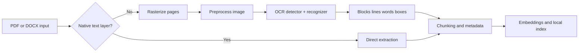
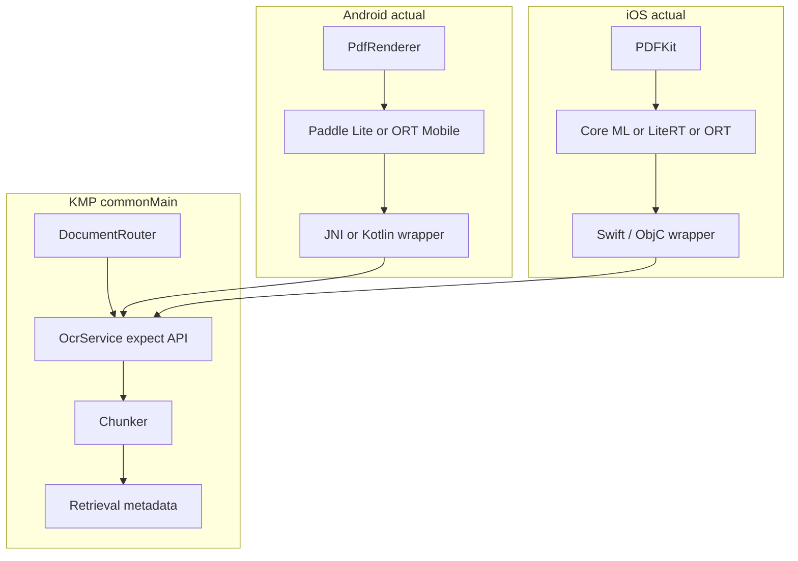

# Mobile OCR Models for Anvit

## Executive summary

For **Anvit**, the best current open-source choice is **PaddleOCR’s PP-OCRv5 mobile stack**, with a strong recommendation to ship **script-specific recognizers** by default and treat the much larger “all-in-one” recognizer and PP-Structure table pipeline as optional add-ons. It is the only major open OCR stack in this review that combines an actively maintained upstream project, explicit **on-device Android/iOS deployment guidance**, a modern multi-stage OCR pipeline, broad language coverage, and a document-structure ecosystem in the same project. citeturn29view0turn23view0turn24search4turn37search0

The best **small-footprint fallback** is **Tesseract 5 with `tessdata_fast`**. It remains an excellent CPU-only, permissively licensed engine with very broad language support, tiny per-language model packs for many scripts, useful structured outputs such as hOCR/TSV/searchable PDF, and easy offline use. Its weaknesses are camera-photo robustness, modern layout understanding, and table structure extraction. citeturn11view2turn13view0turn13view2turn15view0turn36search1

The best **custom/high-control engineering option** is **docTR with a lightweight pair such as `db_mobilenet_v3_large` + `crnn_mobilenet_v3_small`**. Its official docs publish document-oriented benchmarks on **FUNSD** and **CORD**, and its light detection/recognition models are compact by neural-OCR standards. However, docTR is not packaged as a native mobile stack; you would need to own the export path to ONNX/Core ML/TFLite and reimplement parts of the inference pipeline. It is powerful, but not the fastest route to a production KMP app. citeturn8view0turn29view1turn6view3

For a first production release of Anvit on **6 GB devices**, my ranking is:

- **PaddleOCR PP-OCRv5 mobile** for the default OCR path.
- **Tesseract 5 + `tessdata_fast`** as a low-RAM fallback and as a robust searchable-PDF/text-layer generator.
- **docTR-lite** as a second-phase advanced option if you later want more control over model internals or custom training. citeturn29view0turn29view3turn29view1

## What matters for Anvit

For a local **Agentic RAG** app that ingests **PDF and Word documents**, the OCR model is only one part of the pipeline. The model will primarily see **images**: scanned pages, photographed pages, or rasterized PDF pages. Native **DOCX** text should generally be extracted directly from **WordprocessingML/XML**, with OCR reserved for embedded images or image-only content. On Android and iOS, multi-page PDFs should be rasterized page-by-page using platform rendering APIs, then passed into OCR. Android provides `PdfRenderer`, and Apple provides `PDFKit` / `PDFDocument`. Microsoft’s Open XML documentation makes clear that DOCX text is stored as XML elements such as paragraphs, runs, and text nodes. citeturn28search5turn28search0turn28search3turn28search1turn28search7

That means your real selection criteria are not only raw OCR accuracy. For Anvit, the decisive factors are:

- **Total package size** after bundling weights.
- **Peak working RAM** during rasterization, detection, crop batching, and post-processing.
- **Whether the project has a real mobile deployment path** for Android and iOS.
- **How much layout information** it returns for chunking, citation grounding, and downstream RAG.
- **How well it handles photographed documents**, not just clean scans.
- **How painful the KMP integration layer will be** across JNI, C/C++, Objective-C, Swift, and Kotlin/Native interop. citeturn23view0turn34view0turn34view2turn34view3

The diagram above is the architecture I would target for Anvit v1: **prefer native extraction first**, then OCR only when needed. That minimizes battery use, latency, and hallucination risk in the RAG layer. The platform APIs and file formats above support exactly that split. citeturn28search5turn28search0turn28search3turn28search1

## Candidate comparison

### Comparison table

| Candidate | License | Core architecture | Official pretrained weights | Language/script support | Layout / table support | Handwriting | Mobile deployment fit | Maintenance signal |
|---|---|---|---|---|---|---|---|---|
| **PaddleOCR PP-OCRv5 mobile** | Apache 2.0 | Multi-stage OCR pipeline with detection, optional orientation classification, and recognition; official on-device deployment via Paddle Lite; optional PP-Structure document-analysis modules | Yes | PaddleOCR repo advertises **100+ languages**; current PP-OCRv5 mobile recognizer specifically targets Chinese/Traditional Chinese/English/Japanese, while the broader model zoo includes many script-specific mobile recognizers | **Best in class among open stacks here**: PP-StructureV3 adds layout, table classification, table cell detection, table structure recovery, and formula paths, though several of those models are too large for a practical default mobile bundle | Official PP-OCRv5 mobile recognizer description explicitly mentions **handwriting** support | **High** | Very active: ~78.1k GitHub stars, latest release April 2026 | citeturn29view0turn22search2turn24search4turn37search0turn37search2 |
| **Tesseract 5 + `tessdata_fast`** | Apache 2.0 | Native OCR engine with LSTM-based recognizer; `osd` for orientation/script detection; classic page segmentation modes | Yes | Tesseract supports **more than 100 languages** out of the box, with both language and script models; script packs are especially useful on mobile | Basic page segmentation and structured outputs, but **not modern layout/table understanding** in the way PaddleOCR PP-Structure provides it | Not a strong default handwriting choice in current official docs; no modern handwriting benchmark set is emphasized | **Medium to high** if you accept CPU-only behavior and weaker photo robustness | Very active core repo; current docs and releases still maintained | citeturn11view2turn11view0turn13view0turn13view2turn29view3turn36search1turn30search0 |
| **docTR-lite** | Apache 2.0 | Two-stage deep OCR with lightweight detector options such as `db_mobilenet_v3_large` and lightweight recognizers such as `crnn_mobilenet_v3_small` / `large` | Yes | Out-of-box language packaging is **much narrower** than PaddleOCR or Tesseract; official docs note many recognition models are trained on their French vocab and expose the vocabulary | Good line/block grouping and rotated/skewed document handling; **no first-class official table-structure stack** comparable to PP-Structure | No strong official handwriting story for mobile deployment | **Medium** technically possible, but requires custom export/inference engineering | Active: ~6.1k stars, latest release Feb 2026 | citeturn8view0turn29view1turn6view3 |
| **EasyOCR** | Apache 2.0 | CRAFT detector + CRNN recognizer with PyTorch runtime | Yes | **80+ languages** | Boxes and text only; no serious official table/layout stack | Handwritten support is explicitly still on the roadmap | **Low** for production mobile/KMP because official mobile deployment is not the focus | Popular, but latest release shown is Sep 2024 | citeturn10view0turn29view2 |
| **MMOCR** | Apache 2.0 | Research toolbox with many detectors and recognizers; DBNet/DBNet++/CRNN/SATRN/ABINet/etc. | Yes | Strong research model zoo, but not packaged as a broad mobile multilingual OCR product | Strong research coverage; KIE supported; still **not a mobile-first document OCR kit** | Depends on selected model, not a cohesive mobile handwriting solution | **Low** for Anvit v1 because dependency stack is heavy | Latest release shown July 2023 | citeturn19view0turn19view1turn29view4 |

The comparison above is synthesized from the official repositories and documentation for PaddleOCR, Tesseract, docTR, EasyOCR, and MMOCR. PaddleOCR is the only candidate here with a clearly documented on-device OCR path for both Android and iOS in the same ecosystem; Tesseract is the smallest and simplest CPU-first fallback; docTR is attractive for custom engineering but not turnkey mobile deployment. citeturn23view0turn23view1turn34view0turn36search1turn8view0turn10view0turn19view0

### Size, memory, and speed on 6 GB devices

Below is the most practical way to think about **disk footprint** and **working-set RAM** for Anvit:

| Candidate | Published size signals | Practical bundle for Anvit | Estimated peak RAM on 6 GB device | Estimated per-page latency on mobile SoCs |
|---|---|---|---|---|
| **PaddleOCR PP-OCRv5 mobile** | Official docs list `PP-OCRv5_mobile_rec` at **136 MB** and the optional text-line orientation model at **0.32 MB**. The multilingual mobile model lists also show several script-specific recognizers in the **~7.8–9.7 MB** range. Legacy on-device OCR bundles for PP-OCRv3 are published at **5.9 MB** and **16.2 MB**, showing the expected mobile size class for lightweight end-to-end OCR bundles. | **Best practice:** bundle one or a small set of script-specific recognizers by locale or on-demand download. Avoid bundling the full 136 MB recognizer unless you truly need that exact Chinese/Trad/English/Japanese/handwriting mix offline from day one. | **~80–180 MB** for a script-specific bundle; **~180–350 MB** for the large recognizer plus page buffers and post-processing. | **Engineering estimate:** ~**300–900 ms/page** on Snapdragon 7-class CPUs, **150–450 ms/page** on Snapdragon 8-class CPUs, **120–300 ms/page** on Apple A16/A17 when using an optimized path and moderate raster resolution. |
| **Tesseract 5 + `tessdata_fast`** | Official English `eng.traineddata` in `tessdata_fast` is **3.92 MB**; `tessdata_best` English is **14.7 MB**; larger languages can be much bigger, for example the `chi_sim` traineddata in `tessdata` is **42.3 MB**. | Very attractive if you load **only one or two languages/scripts at a time**. | **~40–120 MB** for Latin/script models; can rise substantially with larger CJK packs or multiple simultaneous languages. | **Engineering estimate:** ~**900–2500 ms/page** on Snapdragon 7-class, **500–1500 ms/page** on Snapdragon 8-class, **400–1200 ms/page** on Apple A16/A17. |
| **docTR-lite** | Official docs publish parameter counts: `db_mobilenet_v3_large` **4.2M params** and `crnn_mobilenet_v3_small` **2.1M params**. That implies roughly **~25 MB FP32**, **~13 MB FP16**, or **~6–7 MB INT8** just for a lightweight pair before runtime overhead and packaging format. | Feasible if you own the export path and keep the vocab controlled. | **~150–300 MB** peak because activation maps and crop batching dominate more than raw weight size. | **Engineering estimate:** ~**900–2500 ms/page** on Snapdragon 7-class, **500–1400 ms/page** on Snapdragon 8-class, **400–1200 ms/page** on Apple A16/A17 with a good Core ML/Metal path; slower if CPU-only. |

These device figures are **engineering estimates**, not vendor-published phone benchmarks. The official sources reviewed here publish model sizes, some desktop/reference CPU timings, and runtime/delegate capabilities, but I did **not** find an authoritative table giving latency for these OCR models specifically on Snapdragon 7/8 or Apple A-series phones. The estimates above are therefore derived from the official size/parameter data, from the nature of each runtime stack, and from the documented mobile runtimes available for Paddle Lite, ONNX Runtime Mobile, LiteRT, and Core ML. citeturn37search0turn23view1turn15view0turn17view0turn16search0turn8view0turn34view0turn35view0turn35view1turn35view2

### Accuracy and document-oriented benchmarks

**PaddleOCR** currently exposes many task-specific metrics in its official model pages, but the public docs are not as cleanly normalized across document datasets as docTR or MMOCR. The strongest practical signal is that PaddleOCR’s current model zoo is extensive, actively maintained, and tied to a dedicated document-analysis stack. The current PP-StructureV3 page explicitly describes `PP-OCRv5_mobile_rec` as a new-generation recognizer that supports Chinese, Traditional Chinese, English, Japanese, handwriting, vertical text, pinyin, and rare characters, and it also publishes model sizes and CPU/GPU inference timing fields for the current OCR modules. citeturn37search0turn37search2

**Tesseract** still has the clearest official open benchmark story around its own legacy testing flow: the Tesseract documentation includes **UNLV testing scripts** and example results on the 1995 OCR accuracy test sets, with reported word accuracies such as **96.83%** on `bus.3B`, **96.34%** on `doe3.3B`, **96.01%** on `mag.3B`, and **97.68%** on `news.3B` in the original reformatted examples. That is useful for baseline regression testing, especially for clean bitonal scans, but it is not a modern photographed-document benchmark. citeturn13view1

**docTR** has the cleanest official **document OCR** benchmark tables of the candidates I reviewed. Its lightweight detector `db_mobilenet_v3_large` has **4.2M parameters** and reports **FUNSD recall/precision 82.69 / 84.63** and **CORD recall/precision 94.51 / 70.28**. For recognizers, `crnn_mobilenet_v3_small` has **2.1M parameters** and reports **FUNSD exact/partial 87.25 / 87.99** and **CORD exact/partial 93.91 / 94.34**. The end-to-end pairings are also published, though most official end-to-end examples in the docs use `db_resnet50` rather than the lighter mobile detector. citeturn8view0

**MMOCR** is the strongest official source for **ICDAR-style** OCR reporting among the research toolboxes. Its current model zoo publishes text-detection **ICDAR2015 hmean-iou** values such as **0.8169** for `DB_r18`, **0.8644** for the stronger `DBNet` OCLIP variant, and text-recognition averages across **IIIT5K, SVT, ICDAR2013, ICDAR2015, SVTP, CT80**, with recognizers like `SATRN` reaching **0.90** average word accuracy while its basic `CRNN` baseline sits at **0.70**. This is valuable for research comparison, but MMOCR’s dependency and deployment profile is not a good match for Anvit v1. citeturn19view1turn20view0turn20view1

### Layout, tables, handwriting, and inputs

For **layout and tables**, PaddleOCR is clearly ahead in the open-source/mobile-adjacent space because **PP-StructureV3** includes table classification, table cell detection, and table structure recognition modules. The catch is footprint: the same official page shows components such as **table classification at 6.6 MB**, but also much heavier modules such as **`SLANeXt_wired` at 351 MB** and **`RT-DETR-L_wired_table_cell_det` at 124 MB**. In other words: **yes, open-source table analysis exists in the Paddle ecosystem, but no, you probably do not want to ship the heavier table stack inside a default 6 GB-phone local bundle.** citeturn37search0

For **inputs**, all OCR candidates in this report should be treated as **image OCR engines**. They support scanned document images and photographed pages directly. Multi-page PDF support comes from your **page rasterization pipeline**, not from the OCR model itself. Native Word extraction is a separate non-OCR path because DOCX stores text in XML. That is the right architecture for a local RAG app. citeturn28search5turn28search0turn28search1

For **handwriting**, only PaddleOCR’s current PP-OCRv5 mobile recognizer explicitly advertises handwriting support in the reviewed official docs. EasyOCR specifically lists handwriting support as something “coming next,” which is one reason I would not choose it for a production document app. Tesseract and docTR can sometimes perform acceptably on neat handwriting or machine-like handwriting, but neither presents a mobile-ready handwriting story in the official materials reviewed here. citeturn37search0turn10view0

## Ranked recommendation

### PaddleOCR PP-OCRv5 mobile

This is the best default for Anvit.

The reasons are straightforward. PaddleOCR is the most complete open ecosystem in this set for **document OCR**, not just scene-text demos. Its current upstream is highly active, it has **document-oriented and on-device documentation**, it supports **100+ languages** at the project level, and it has an official Android/iOS on-device path through **Paddle Lite** with model optimization to `.nb` format. The OCR stack is also modular enough that you can start with plain OCR and later add more structure, orientation handling, or selective PP-Structure components. citeturn29view0turn23view0turn23view1turn24search4

The main trade-off is **weight granularity**. If you naively ship the larger current PP-OCRv5 mobile recognizer as your default, your storage footprint rises quickly. But Anvit does not need to do that. The right move is to ship **one small script-specific recognizer by default** and make secondary recognizers downloadable per user language mix, or build regional variants of the app bundle. That gives you the best accuracy-per-watt outcome on 6 GB devices. citeturn37search0turn37search2

My practical recommendation is:

- Start with **PaddleOCR PP-OCRv5 mobile OCR only**, no heavy PP-Structure tables in v1.
- Bundle **Latin or Devanagari** script packs first if your target market is India-centric and English-heavy.
- Add the large PP-OCRv5 mobile recognizer only as an opt-in download if you truly need the full Chinese/Traditional Chinese/English/Japanese/handwriting set offline. citeturn37search0turn37search2

### Tesseract 5 with `tessdata_fast`

This is the best fallback and the best “minimum viable local OCR” path.

Tesseract remains compelling because it is **small, battle-tested, fully offline, Apache-licensed, and script-rich**. It can be compiled for Android and iPhone, has a stable API, and emits outputs that are useful for RAG provenance such as **plain text, hOCR, TSV, ALTO, PAGE, and searchable PDF**. For clean scans and monochrome document pages, especially if native text extraction has already filtered out digital documents, it is still a very useful component. citeturn11view2turn36search1turn13view2

Its weaknesses matter for Anvit, though: it is **worse on camera captures**, it does not give you a modern table/layout stack, and its multi-language ordering and page segmentation can materially change output and runtime. That makes it ideal as a **fallback** or as an ultra-conservative mode, not as the single flagship OCR path. citeturn13view2

Use Tesseract when:

- Battery or RAM pressure is high.
- You only need **one or two languages/scripts** at a time.
- You want a **searchable-PDF or hOCR fallback**.
- You are processing mostly **scanned forms, monochrome documents, or clean office scans**. citeturn13view0turn13view2

### docTR lightweight pair

This is the best high-control custom path.

docTR deserves a top-three place because it publishes exactly the kind of document-centric benchmarking that a serious engineering review wants, and its lightweight `db_mobilenet_v3_large` and `crnn_mobilenet_v3_small` models are genuinely compact. It can also reason over rotated/skewed documents and provides useful grouping behavior for lines and blocks. If you later decide that Anvit needs a fully custom OCR path with your own vocab, your own export steps, and your own benchmark harness, docTR is the most interesting foundation of the non-Paddle neural stacks I reviewed. citeturn8view0turn6view3

I rank it below PaddleOCR and Tesseract because it is **not a mobile product out of the box**. The official installation and usage experience is Python/PyTorch oriented, and the docs note model vocabulary details that make it less attractive for unconstrained multilingual deployment. For Anvit v1, that translates into more engineering risk than benefit. citeturn6view3turn29view1

## Integration roadmap for KMP

### Recommended architecture

This is the cleanest KMP shape for Anvit. Keep **document routing, OCR policy, chunking, and metadata normalization** in shared Kotlin. Put **page rendering and OCR runtime binding** behind platform-specific `actual` implementations. Kotlin Multiplatform’s `expect`/`actual` mechanism is explicitly designed for this, and Kotlin/Native supports C interop plus Objective-C interoperability. Kotlin/Native can import Objective-C frameworks and C libraries, but **pure Swift modules are not directly supported unless their API is exported to Objective-C**. citeturn27search2turn34view2turn34view3

### Concrete implementation path

#### Baseline path I recommend

On **Android**, use one of these:

- **Paddle Lite official OCR path** for PP-OCRv5 mobile if you want the most official integration route.
- **ONNX Runtime Mobile** if you standardize on ONNX across engines and are willing to convert from Paddle with Paddle2ONNX. ORT Mobile explicitly supports Android and iOS. citeturn23view0turn24search4turn34view0

On **iOS**, use one of these:

- **Core ML** if you build or convert a mobile model path that works cleanly with Apple’s on-device stack.
- **LiteRT** if your model export lands naturally in TFLite and you want delegates such as Core ML or Metal.
- **ONNX Runtime Mobile** if you want the same runtime family on both Android and iOS. Core ML itself is designed to use CPU, GPU, and Neural Engine efficiently and integrates tightly with Xcode. LiteRT on iOS documents optional **Core ML** and **Metal** delegates. citeturn35view2turn34view6turn35view1turn35view0turn34view0

For **KMP bindings**:

- Use `expect interface OcrEngine` in `commonMain`.
- On Android, implement `actual class PaddleOcrEngine` in Kotlin and call into either JNI/C++ or the runtime’s Java/Kotlin bindings.
- On iOS, either call Objective-C/C APIs directly from Kotlin/Native through cinterop, or create a thin Swift/Objective-C wrapper and expose only a stable Objective-C surface to Kotlin. CocoaPods integration is supported by Kotlin/Native if you decide to consume Pods on the Apple side. citeturn34view1turn34view2turn34view3

### Suggested roadmap and effort

| Phase | Goal | Estimated effort | Recommended choice |
|---|---|---:|---|
| **Document triage** | Route DOCX to native extraction, rasterize image-only PDFs/pages | **3–5 days** | Required for all options |
| **Android OCR MVP** | Integrate PP-OCRv5 mobile or Tesseract fast on Android | **5–7 days** | Start with PaddleOCR mobile; keep Tesseract fallback |
| **iOS OCR MVP** | Integrate Core ML / LiteRT / ORT wrapper on iOS | **7–10 days** | If Paddle Lite on iOS feels heavy, use a thin Apple-native wrapper around converted models |
| **Shared metadata normalization** | Convert OCR output to blocks/lines/words/chunks with page refs | **3–4 days** | KMP shared |
| **Benchmark harness** | Latency, RAM, WER/CER, thermals, table stress tests | **3–4 days** | Required before production rollout |
| **Fallback path** | Add Tesseract fast as low-RAM safe mode | **2–4 days** | Strongly recommended |

If you want the **lowest-risk roadmap**, do this:

1. **DOCX direct extraction first**.
2. **Android + iOS OCR MVP using PaddleOCR mobile**.
3. **Tesseract fallback mode** for low-RAM or unsupported pages.
4. Only later, if needed, add **table-heavy PP-Structure** or a **docTR custom path**. citeturn28search1turn23view0turn23view1turn36search1

## Minimal on-device test plan

Because official **phone-specific** latency data is incomplete, Anvit should ship only after an on-device benchmark pass that you own.

### Dataset mix

Use a **200-page minimum** corpus:

- **60 clean scanned office pages**.
- **40 photographed phone captures** with skew, shadows, and perspective.
- **40 forms/tables**.
- **30 multilingual pages** drawn from the scripts you actually expect in-market.
- **30 hard pages**: low contrast, blur, rotated pages, stamps, signatures, handwritten notes in margins.

For public data, anchor the evaluation to:

- **FUNSD** and **CORD**, because docTR publishes document OCR metrics on them.
- **ICDAR2015** for text detection sanity checks if you compare against research models.
- **UNLV 3B-style scans** for Tesseract regression baselines. citeturn8view0turn20view0turn13view1

### Metrics

For Anvit, the key metrics are:

- **Character Error Rate** and **Word Error Rate**.
- **Block/line segmentation precision and recall**.
- **Table extraction success rate** on the subset where tables matter.
- **P50 / P95 page latency**.
- **Peak RSS / memory footprint**.
- **Battery draw and thermal throttling** over a 50-page batch.
- **Chunk boundary quality** for downstream RAG.  

LiteRT explicitly recommends benchmarking delegates on your own model/device combination and notes that the benchmark tool can measure latency, initialization overhead, and memory footprint. That guidance matches what you should do here. citeturn35view0

### Test devices

Use at least one device from each class:

- **Snapdragon 7-class** Android phone.
- **Snapdragon 8-class** Android phone.
- **Apple A16/A17-class** iPhone.

Run each model in:

- **Default CPU mode**.
- **Best available hardware-accelerated mode**.
- **Low-memory mode** with reduced raster DPI or smaller batch sizes.  

This is especially important because LiteRT and Core ML both emphasize that delegate usefulness is device- and model-dependent, and Core ML provides tooling to inspect load/prediction times and compute-unit usage on connected devices. citeturn35view0turn35view1turn35view2

## Risks, limitations, and legal considerations

The largest unresolved issue in this space is **missing official per-phone latency tables**. I found good official sources for model sizes, parameter counts, document benchmark tables, Android/iOS runtime support, and delegate behavior, but not high-confidence official measurements of these exact OCR models on Snapdragon 7/8 or Apple A-series handsets. That is why the RAM and per-page latency numbers in this report are presented as **engineering estimates** and why I strongly recommend an internal benchmark harness before locking the deployment choice. citeturn34view0turn35view0turn35view1turn35view2

On **licenses**, the top candidates reviewed here are permissive: **Apache 2.0** for PaddleOCR, Tesseract, docTR, EasyOCR, and MMOCR, and **MIT** for keras-ocr. Apache 2.0 is generally favorable for commercial mobile apps because it includes an express patent license; MIT is also commercially friendly. The remaining legal risk is usually not the core runtime license but **weight redistribution provenance**, your own training data, and any third-party assets you bundle. citeturn29view0turn11view2turn29view1turn29view2turn29view4turn31view0

Two well-known projects I would **not** choose for Anvit v1 are **EasyOCR** and **MMOCR**. EasyOCR is popular and language-rich, but its official repo is still PyTorch-centric, handwriting is still listed as future work, and there is no comparable official mobile deployment story. MMOCR is excellent for research benchmarking and ICDAR-style comparisons, but its dependency stack around PyTorch/MMCV/MMDetection is too heavy for a clean KMP mobile product. citeturn10view0turn19view0turn19view1

### Open questions and limitations

The main open questions after this review are:

- The official PaddleOCR docs I reviewed are strong on model catalogs and mobile deployment, but they do **not** give a complete phone-by-phone latency matrix for PP-OCRv5 mobile on Snapdragon 7/8 or Apple A-series devices. citeturn23view0turn37search0
- docTR’s official docs are excellent for benchmarks and architecture selection, but they do **not** provide a first-class mobile export/deployment guide comparable to PaddleOCR’s Android/iOS story. citeturn8view0turn29view1
- Tesseract remains extremely valuable as a fallback, but the official materials reviewed here do **not** position it as a modern layout/table engine, so table-heavy document understanding will need either Paddle PP-Structure modules or a separate strategy. citeturn13view0turn13view2

The practical conclusion is still clear: **ship PaddleOCR mobile first, keep Tesseract as fallback, and treat docTR as a phase-two advanced path.** citeturn29view0turn29view3turn29view1