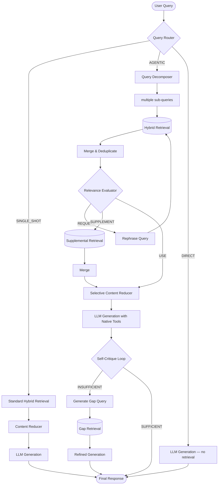

# Anvit — Local Agentic RAG for Android

A fully local, privacy-first Android app for intelligent document analysis and multimodal Q&A using Gemma 4 and an agentic RAG pipeline. No cloud. No API keys. Everything runs on-device.

---

## App Name
**Anvit** — because it brings wisdom from your documents.  
Package: `com.likhith.anvit`

---

## Features

### Multimodal Input
- **Image attachment** — attach a photo or image from the gallery alongside a text query; Gemma 4 processes both natively
- **Audio recording** — tap the mic button to record a voice query; audio is captured as WAV (16kHz mono PCM) compatible with LiteRT-LM's miniaudio decoder
- **Audio transcription** — recorded audio is automatically transcribed before RAG retrieval so spoken questions produce meaningful vector search results
- **Audio + text combined** — when both audio and text are provided, the transcription is prepended to the typed text and both are used as the RAG query
- **Audio playback in chat** — sent audio messages are stored and playable directly in the chat screen with a progress bar and duration display

### Agentic RAG Pipeline
- **Query routing** — classifies each query as SINGLE_SHOT (direct retrieval) or AGENTIC (multi-step pipeline) based on complexity
- **Query decomposition** — breaks compound questions ("compare X and Y across documents") into focused sub-queries, each retrieved independently
- **Hybrid retrieval** — combines vector cosine similarity and BM25 (FTS5) full-text search, merged via Reciprocal Rank Fusion (RRF)
- **CRAG relevance evaluation** — scores retrieved chunks; if relevance is low it re-queries with a rephrased version (up to 2 attempts) or supplements with additional passages
- **Selective content reduction** — trims retrieved chunks ~30% before passing to the LLM, reducing prompt length and latency
- **Native tool calling** — Gemma 4 autonomously calls `search_documents` and `get_document_section` tools during generation to fetch additional context mid-response
- **Self-critique loop** — after generating an answer, evaluates completeness; if gaps are found, retrieves targeted extra context and refines the response
- **Document collections** — organise PDFs into named collections; each chat session can be scoped to a specific collection or run across all documents

### Chat Interface
- **Multi-session chat** — create, rename, and delete independent chat sessions; sessions are grouped by Today / Yesterday / Earlier in the side drawer
- **Auto session titling** — new sessions are automatically named from the first message (or audio transcription for voice-only queries)
- **Streaming responses** — assistant replies stream token by token with animated loading indicators
- **Thinking mode** — toggleable chain-of-thought reasoning via Gemma 4's `<|think|>` tokens; thinking content is shown in a collapsible panel that auto-closes when the response begins
- **Agent steps panel** — collapsible timeline showing each pipeline step (routing, decomposition, retrieval, reduction, generation) with human-readable descriptions
- **Source citations** — referenced document chunks are shown as tappable cards below each response; tapping a card shows the full passage
- **"Transcribed" label** — audio-only messages show a mic + "Transcribed" badge to indicate the displayed text was auto-transcribed from speech
- **Message actions** — copy, edit and re-send, or restart generation from any user message
- **Stop generation** — cancel an in-progress response at any point
- **Direct chat mode** — when no collection is selected, Anvit answers without RAG (plain LLM conversation); a "Direct chat" badge marks these responses

### Document Management
- **PDF ingestion** — import PDFs via the system file picker; text is extracted (iText7), chunked with overlap, embedded, and stored in Room + FTS5
- **Collection management** — create, rename, and delete named collections; assign documents to collections at import time
- **Ingestion progress** — per-document progress shown during embedding
- **Chunk statistics** — total chunk counts visible per document and collection

### Settings & Model Configuration
- **Model selection** — choose between Gemma 4 E2B (default, ~1.3 GB) and Gemma 4 E4B (~2.5 GB)
- **Accelerator selection** — CPU (default) or GPU backend; GPU includes an experimental warning since support varies by device
- **Temperature** — 0.0 – 2.0 (default 1.0)
- **Max output tokens** — 100 – 32,000 (default 4,000)
- **Top-K** — token sampling breadth
- **Enable Agentic RAG** — toggle the full multi-step pipeline on/off
- **Self-critique loop** — toggle post-generation refinement
- **Retrieval mode** — vector / BM25 / hybrid
- **Max retrieval chunks** — number of chunks fed to the LLM per query
- **Thinking mode** — toggle chain-of-thought reasoning
- **Embedding model selection** — EmbeddingGemma-300M (recommended) or Gecko-110M

---

## Architecture Overview

For a detailed breakdown of the agentic components, see [Agents.md](Agents.md).

---

## Settings Reference

| Setting | Description | Default |
|---------|-------------|---------|
| Model | Gemma 4 E2B or E4B | E2B |
| Accelerator | CPU or GPU backend | CPU |
| Enable Thinking | Chain-of-thought reasoning | On |
| Enable Agentic RAG | Full multi-step pipeline | On |
| Self-Critique Loop | Post-generation refinement | On |
| Native Tool Calling | Gemma 4 autonomous tool use | On |
| Retrieval Mode | vector / bm25 / hybrid | hybrid |
| Max Retrieval Chunks | Chunks fed to LLM | 5 |
| Temperature | Generation randomness | 1.0 (range 0.0–2.0) |
| Max Output Tokens | Max tokens per response | 4,000 (range 100–32,000) |
| Top-K | Token sampling breadth | 40 |

---

## RAM Budget (Gemma 4 E2B)

| Component | RAM |
|-----------|-----|
| Gemma 4 E2B Q4 (LiteRT-LM) | ~1.3 GB |
| EmbeddingGemma-300M | ~300 MB |
| Room DB + FTS5 index | ~50–200 MB |
| KV cache + buffers | ~500 MB |
| **Total** | **~2.2–2.5 GB** |

Works on 6 GB RAM devices. For 4 GB devices, reduce max retrieval chunks to 3 and disable Self-Critique.

---

## Technical Stack

- **LLM Runtime:** Google LiteRT-LM 0.10.0 (`litertlm-android`)
- **Embedding:** Google AI Edge RAG SDK 0.3.0 (`localagents-rag`)
- **PDF:** iText7 Community 7.2.5
- **Database:** Room 2.6.1 + FTS5 for BM25
- **UI:** Jetpack Compose + Material3 (dark navy/teal theme)
- **Language:** Kotlin with Coroutines + Flow
- **Architecture:** MVVM + Repository pattern
- **Audio:** Android `AudioRecord` API, raw PCM → WAV (16kHz mono 16-bit)

---

## Known Limitations

- **Image-only PDFs** (scanned documents) are not supported — text extraction only
- **GPU acceleration** is experimental and may crash on some devices depending on driver support
- **Concurrent queries** not supported — wait for current generation to finish
- **Large PDFs (100+ pages)** take several minutes to embed on first ingest
- **Audio input** requires `RECORD_AUDIO` permission; denied permission disables the mic button

---

## Contributing

Contributions are welcome! To get started:

- Fork the repository
- Create a feature branch (`git checkout -b feature/your-feature`)
- Commit your changes (`git commit -m "Add your feature"`)
- Push to your branch (`git push origin feature/your-feature`)
- Open a Pull Request describing your changes

Please open an issue first to discuss significant changes. For bug reports, include steps to reproduce, expected vs. actual behavior, and your device/Android version.

This project is licensed under the MIT License — see [LICENSE](LICENSE) for details.

