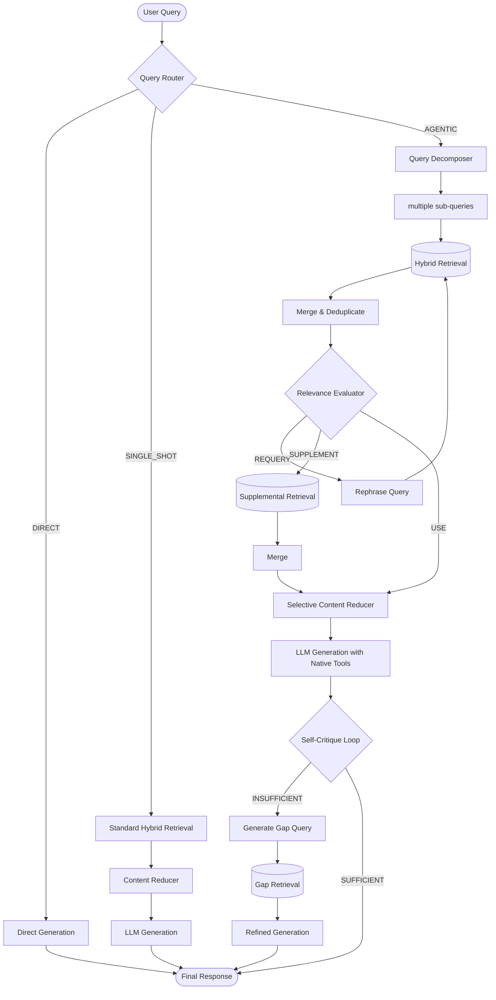

# Sage — Local Agentic RAG for Android

A fully local, privacy-first Android app for intelligent PDF document analysis using Gemma 4 and an agentic RAG pipeline. No cloud. No API keys. Everything runs on-device.

---

## App Name
**Sage** — because it brings wisdom from your documents.  
Package: `com.sage.localai`

---

## Architecture Overview

Sage implements an advanced Agentic RAG pipeline. For a detailed breakdown of the agentic components, see [Agents.md](Agents.md).



---

## Key Files

| File | Role |
|------|------|
| `agentic/AgenticRagOrchestrator.kt` | Main pipeline coordinator |
| `agentic/QueryRouter.kt` | Classify query: DIRECT / SINGLE_SHOT / AGENTIC |
| `agentic/QueryDecomposer.kt` | Break complex queries into sub-questions |
| `agentic/RelevanceEvaluator.kt` | CRAG: evaluate retrieval quality |
| `agentic/SelectiveContentReducer.kt` | Trim chunks before LLM (~30% token reduction) |
| `agentic/SelfCritiqueLoop.kt` | Post-generation quality check + refinement |
| `inference/GemmaInferenceService.kt` | Gemma 4 E2B/E4B via LiteRT-LM |
| `inference/RagAgentTools.kt` | Gemma 4 native tool definitions (search_documents, get_document_section) |
| `embedding/EmbeddingService.kt` | Gecko / EmbeddingGemma-300M embeddings |
| `retrieval/HybridRetriever.kt` | Vector cosine + FTS5 BM25 via Reciprocal Rank Fusion |
| `document/PdfProcessor.kt` | PDF text extraction (iText7) |
| `document/DocumentChunker.kt` | Paragraph → sentence chunking with overlap |
| `document/DocumentIngestionService.kt` | Full PDF → chunks → embeddings → DB pipeline |
| `data/db/SageDatabase.kt` | Room DB (documents, chunks, FTS5, chat history) |
| `ui/screens/ChatScreen.kt` | Chat UI with streaming + agent step display |
| `ui/screens/DocumentsScreen.kt` | PDF upload + knowledge base management |
| `ui/screens/SettingsScreen.kt` | Model selection, RAG config, generation params |

---

## Setup Instructions

### Step 1: Download Model Files

Place the following files in the app's internal storage:
```
Android/data/com.sage.localai/files/models/
```

**LLM (one of):**
- `gemma4-e2b-it-int4.litertlm` — Gemma 4 E2B (~1.3 GB, default, 6 GB RAM devices)
- `gemma4-e4b-it-int4.litertlm` — Gemma 4 E4B (~2.5 GB, 10 GB RAM devices)

**Embedding model (one of):**
- `embeddinggemma-300M_seq2048_mixed-precision.tflite` — EmbeddingGemma (recommended)
- `gecko-110m-en-512.tflite` — Gecko (alternative)

**Tokenizer (optional, for some Gecko models):**
- `sentencepiece.model`

### Step 2: Install the App

Open the project in Android Studio → Build → Run on device (API 27+, arm64).

### Step 3: First Launch

1. Go to **Settings** tab
2. Select model (E2B or E4B)
3. Tap **Load Selected Model** — wait ~10-30 seconds
4. Tap **Initialize** next to Embedding Model
5. Go to **Documents** tab → tap **+** → select a PDF
6. Wait for ingestion (embedding all chunks takes 1-5 minutes per PDF)
7. Go to **Chat** tab → ask questions about your documents

---

## Agentic RAG Features

| Feature | Description |
|---------|-------------|
| **Query Routing** | Skips retrieval for simple queries; saves battery |
| **Query Decomposition** | Breaks "compare X and Y" into sub-questions |
| **Hybrid Retrieval** | Vector (cosine) + BM25 (FTS5) merged via RRF |
| **CRAG Evaluation** | Checks chunk relevance; re-queries if poor |
| **Selective Content Reduction** | Trims chunks ~30% before LLM; reduces latency |
| **Native Tool Calling** | Gemma 4 autonomously calls search_documents |
| **Self-Critique Loop** | Evaluates its own answer; refines if incomplete |
| **Thinking Mode** | Gemma 4 chain-of-thought via `<\|think\|>` tokens |

---

## RAM Budget (Gemma 4 E2B)

| Component | RAM |
|-----------|-----|
| Gemma 4 E2B Q4 (LiteRT-LM) | ~1.3 GB |
| EmbeddingGemma-300M | ~300 MB |
| Room DB + FTS5 index | ~50-200 MB |
| KV cache + buffers | ~500 MB |
| **Total** | **~2.2–2.5 GB** |

Works on 6 GB RAM devices. For 4 GB devices, reduce chunk count to 3 and disable Self-Critique.

---

## Settings Reference

| Setting | Description | Default |
|---------|-------------|---------|
| Model | Gemma 4 E2B or E4B | E2B |
| Enable Thinking | Chain-of-thought reasoning | On |
| Enable Agentic RAG | Full multi-step pipeline | On |
| Self-Critique Loop | Post-generation refinement | On |
| Retrieval Mode | vector / bm25 / hybrid | hybrid |
| Max Retrieval Chunks | Chunks fed to LLM | 5 |
| Temperature | Generation randomness | 1.0 |
| Top-K | Token sampling breadth | 40 |

---

## Technical Stack

- **LLM Runtime:** Google LiteRT-LM 0.10.0 (`litertlm-android`)
- **Embedding:** Google AI Edge RAG SDK 0.3.0 (`localagents-rag`)
- **PDF:** iText7 Community 7.2.5
- **Database:** Room 2.6.1 + FTS5 for BM25
- **UI:** Jetpack Compose + Material3 (dark navy/teal theme)
- **Language:** Kotlin with Coroutines + Flow
- **Architecture:** MVVM + Repository pattern

---

## Known Limitations

- **Image-only PDFs** (scanned documents) are not supported — text extraction only
- **GPU acceleration** is temporarily CPU-only (LiteRT-LM 0.10.0 GPU bug, fixed in 0.10.1)
- **Concurrent queries** not supported — wait for current generation to finish
- **Large PDFs (100+ pages)** take several minutes to embed on first ingest

---

## Credits

Adapted from [LLM-Hub](https://github.com/timmyy123/LLM-Hub) — specifically the LiteRT-LM inference service and Gecko embedding service patterns.
